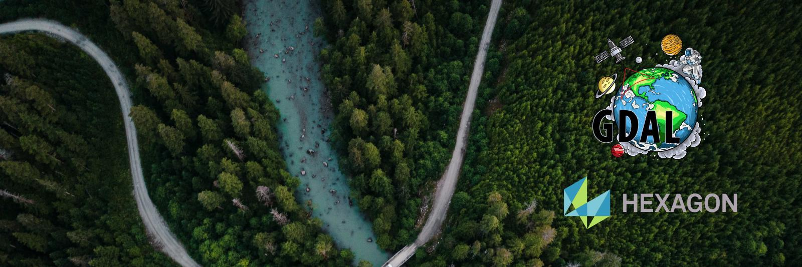

 
 
 O formato de arquivo [ECW](https://en.wikipedia.org/wiki/ECW_(file_format)hexagon ), propriedade da [Hexagon](https://hexagon.com/), é frequentemente utilizado para a disponibilização de imagens aéreas de alta resolução com tamanho de arquivo reduzido quando comparado a outros populares formatos de imagens georreferenciadas. A licença grátis oferecida pela empresa permite a leitura do arquivo ECW e conversão para algum outro formato de imagem suportado pelo GDAL. A conversão de um arquivo de imagem de algum formato livre para ECW requer compra de licença do SDK (Software Development Kit) da Hexagon. Enquanto a instalação no Windows é simples, bastando alguns cliques para que o SDK esteja disponível para utilização por linha de comando ou pela interface gráfica do QGIS, em distribuições Linux é necessário fazer o download do SDK e usá-lo na compilação do GDAL com configurações específicas.

Este tutorial é baseado em tutorial que criei para instalação local do GDAL, onde mostrava como fazer a compilação em sistemas baseados em Debian/Ubuntu. A instalação local funciona bem, contudo é um processo trabalhoso, demorado e dependente de distribuições específicas. A Hexagon também implementou recentemente algumas restrições para download de seus produtos, o que torna a antiga solução criada por mim obsoleta.

A conteinerização do ambiente para esta tarefa simples é uma solução mais vantajosa pois o Docker está disponível para vários sistemas operacionais e o ambiente de desenvolvimento é facilmente reproduzível entre máquinas. Além disso, pessoas não-desenvolvedoras, mas que utilizam alguma distribuição Linux podem usar esta solução para facilitar seus fluxos de trabalho. 

---

* Clone este repositório para sua máquina usando HTTPS ou SSH.

* Copie o binário de instalação do SDK para a pasta raiz do repositório. Caso você ainda não o tenha, recomendo criar uma conta na Hexagon e fazer download do SDK por [esta página](https://supportsi.hexagon.com/s/article/ERDAS-ECW-JP2-SDK-Read-Only-Redistributable-download). Verifique o Dockerfile e se estiver de acordo com ele, construa a imagem base para o contêiner com o seguinte comando:

~~~sh
docker build -t geolinux:gdal-ecw
~~~

* Instancie um novo contêiner utilizando como base na imagem criada e associe uma pasta do seu computador a uma pasta do contêiner para facilitar seu trabalho. Dessa forma tudo o que você copiar para a pasta da sua máquina está disponível dentro do ambiente conteinerizado e tudo o que você produzir dentro deste ambiente está facilmente disponível para uso na sua máquina. Eu associei a pasta */tmp/arquivos* local à pasta */home/arquivos* dentro do contêiner, mas você poderia usar quaisquer outras. A flag *-it* acessa o conteiner na pasta definida no WORKDIR do Dockerfile, no nosso caso */home*. Use este comando:

~~~sh
docker run -it -v /tmp/arquivos:/home/arquivos geolinux:gdal-ecw
~~~

* *Ah, e se quiser que o contêiner seja deletado logo depois que sair do ambiente, é só adicionar a flag -rm.*

* Copie seu arquivo .ecw para a pasta */tmp/arquivos* no seu computador.

* Agora você pode acessar dentro do contêiner a pasta */home/arquivos* e executar o comando [*gdal_translate*](https://gdal.org/programs/gdal_translate.html) para converter o arquivo no formato ECW para seu formato de preferência.

---

Referências

[Dockerfile reference](https://docs.docker.com/engine/reference/builder/)
[@IlliaOvcharenko](https://github.com/IlliaOvcharenko/gdal-docker)
[@1papaya gist](https://gist.github.com/1papaya/568c4580b1909071696c1cb119101823)